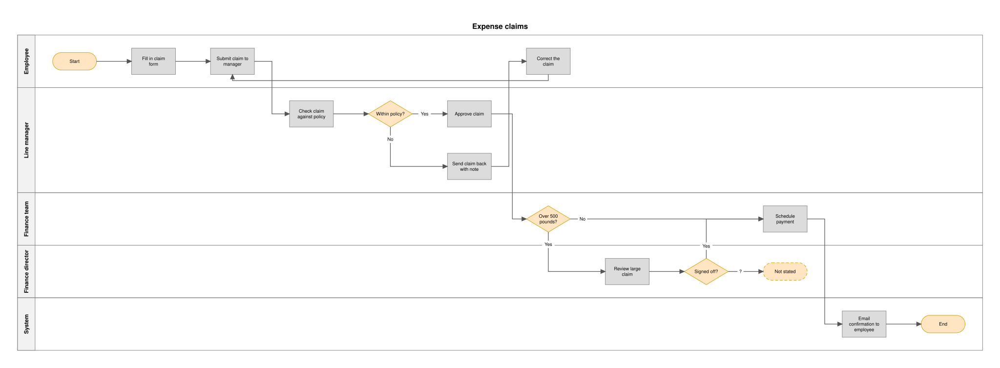
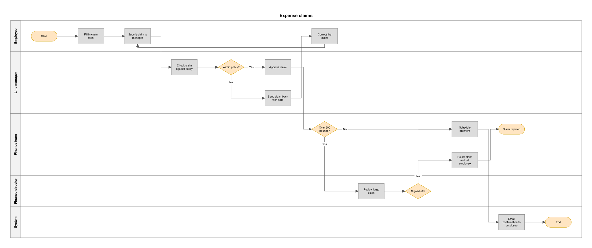
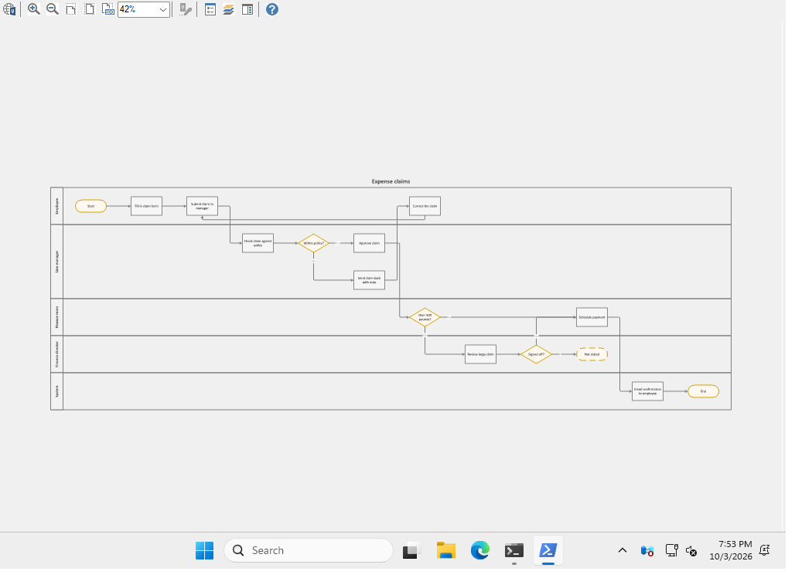
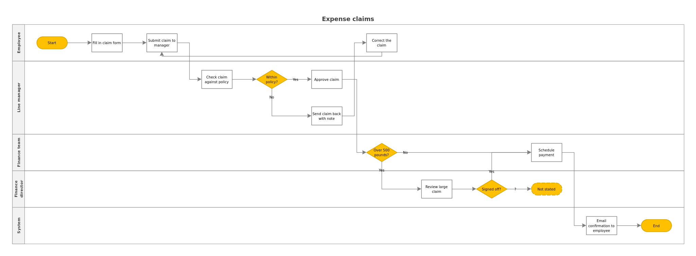

# cursus

**Write the process down. Get the Visio flow chart. See the sentence behind every box.**



That flow chart was made from [sixteen lines of plain text](examples/expense-claim/process.txt).
Nobody dragged a box.

Now look at the dashed one. The text says a large claim needs the finance
director's sign-off. It never says what happens when the director says no.
Another tool would make something up. cursus draws the hole and asks.

## The gap

Businesses run on process flow charts, and most of them live in Visio. Drawing
one by hand takes hours. In 2026 there is still no good way to skip that.

| Who | What you get today |
| --- | --- |
| **Microsoft** | Visio cannot draw a diagram from text. Microsoft's own answer in November 2025: it is ["not currently on the roadmap"](https://learn.microsoft.com/en-us/answers/questions/5633217/is-there-anything-on-the-visio-roadmap-that-is-con). Its Excel add-in that turned a table into a flow chart [was retired in March 2026](https://support.microsoft.com/en-us/visio/about-the-data-visualizer-add-in-for-excel). |
| **draw.io** | Dropped its Visio export in 2025. The maintainer's reason: ["It's too much work."](https://github.com/jgraph/drawio/issues/4942) |
| **Other diagram tools** | They draw well and export to Visio badly. [An independent review](https://bvisual.net/2026/05/25/migrating-from-lucidchart-to-visio/) of one popular export found arrows that had to be re-attached, containers missing and shape data lost. |
| **AI chatbots** | Typically hand back a picture or a block of diagram code, not a Visio file you can open and edit. |
| **All of them** | None tells you where a box came from. You cannot tell a step the author wrote from a step the tool invented. |

## What cursus does differently

### 1. Every box has a receipt

Each step carries the exact sentence it came from, word for word. Select a box
in Visio, open Shape Data, and the sentence is there. A step that quotes
something the text never said is thrown out before anything is drawn.

### 2. It asks instead of guessing

Where the text is silent you get a dashed box and a question, not an
invention. Answer the question and the flow redraws itself.

| Before | After the author answered one question |
| --- | --- |
|  |  |

The answer given was: *"If the finance director refuses, finance rejects the
claim and tells the employee why."* The new step quotes that answer.

### 3. A real Visio file, not a picture of one

The boxes are Visio's own Process, Decision and Start/End shapes. The arrows
are attached at both ends the way Visio attaches them. And we do not just hope
it works: on every change, Microsoft's own Visio Viewer opens every file we
produce and we check it finds every shape and every source sentence.



### 4. Nothing has to leave your computer

cursus works with a model running on your own laptop. For a bank, a hospital
or anyone under NDA, the process description never goes to someone else's
server. Stronger hosted models read better (see the numbers below), and any of
them works by copy and paste.

### 5. It publishes its own scores

Most tools ask you to trust them. cursus keeps a scoreboard: eleven process
descriptions with known right answers, and how each model did against them,
including where it failed.

## The numbers

| Model | Readings good enough to draw | Steps found | Asked about a gap instead of guessing |
| --- | --- | --- | --- |
| Claude Opus | 11 of 11 | 0.96 | 4 of 4 |
| Claude Sonnet | 11 of 11 | 0.94 | 4 of 4 |
| Claude Haiku | 11 of 11 | 0.93 | 3 of 4 |
| Gemma 3, 12B (runs on a laptop) | 23 of 33 | 0.62 | 9 of 12 |
| Gemma 3, 4B (runs on a laptop) | 7 of 33 | 0.17 | 0 of 12 |

"Steps found" runs from 0 to 1, where 1 means every step in the reference
answer. A reading that fails the checks scores zero, because it is never drawn.

Read these with care. The set is small, the reference answers were written for
this project, and the Claude models were scored once each by copy and paste.
The full table and every caveat are in [bench/SCOREBOARD.md](bench/SCOREBOARD.md)
and [bench/README.md](bench/README.md).

## Try it in a minute

```bash
pip install -e ".[dev]"
```

```bash
cursus build examples/expense-claim/reading.json --source examples/expense-claim/process.txt
```

That writes four files into `out/`:

| File | What it is for |
| --- | --- |
| `name.vsdx` | The flow chart, to open and edit in Visio. Each box carries its source sentence. |
| `name.xlsx` | The same flow as a table that Visio's own "create diagram from data" feature reads. |
| `name.svg` | A picture of what the Visio file holds, for anyone without Visio. |
| `name.md` | The questions to ask the author, and the sentence behind every step. |

### From your own text

With a model on your own machine ([Ollama](https://ollama.com)):

```bash
cursus read my-process.txt --model gemma3:12b -o reading.json
```

```bash
cursus build reading.json --source my-process.txt
```

The reading is checked the moment it comes back. If it fails, the faults go
back to the model for another try, twice at most.

With any other model, by copy and paste:

```bash
cursus prompt my-process.txt -o prompt.md
```

Give `prompt.md` to the model and save its answer as `reading.json`.

### Closing the gaps

```bash
cursus questions reading.json -o answers.md
```

Write the answers into `answers.md`, then read and build again with
`--answers answers.md`. The answers become part of the text, so a step that
comes from an answer quotes the answer.

## What is refused before anything is drawn

A flow chart that looks right and is wrong is worse than none. A reading with
any of these faults is not drawn:

- A step whose quote is not in the text, word for word.
- A step with no quote that is not marked as a guess.
- An arrow pointing at a step that does not exist.
- A decision with one way out, unless a question owns up to the gap.
- Two exits from a decision with the same label, or no label.
- Two arrows leaving a step that is not a decision.
- A step nothing leads to, or a path that never reaches an end.

## Where it stands, honestly

**Proven**

- The checks, the question-and-answer loop and the scoreboard are built and tested.
- Microsoft's Visio Viewer and LibreOffice both open every file and draw it correctly, on every change.

**Not proven yet**

- Nobody has opened a file in full Visio. Only full Visio can show a "repair" message, or show that arrows follow a box when you drag it. The [testpack](testpack/README.md) is ready for that.
- The Excel table has not been tried in Visio's "create diagram from data".

**Not built yet**

- Visio's own swimlanes. Rows per role are plain rectangles for now.
- Sub-process and document shapes (drawn as a Process box for now).
- Calling a hosted model directly, instead of by copy and paste.
- Public reference sets on the scoreboard, next to our own eleven cases.

## How we check a Visio file without owning Visio

Three things check every file on every push.

**Microsoft's free Visio Viewer opens it.** This is Microsoft's own code for
reading and drawing Visio files. We check that it finds the right number of
shapes, recognises them as Visio's stock shapes, and reads back the source
sentence stored on each box. Its picture is the one further up. The Yes and No
labels look faint there; a file saved by Visio itself looks the same in the
Viewer, so that is the Viewer, not our file.

**LibreOffice opens it.** A second program that shares no code with us or with
Microsoft draws the same file:



**We only write what Visio writes.** A test compares every kind of thing in our
files against files Visio itself saved. Of about 150, all but three appear in
Visio's own files, and the three are listed with the reason in
[the test](tests/test_same_words_as_visio.py).

A checker that passes everything proves nothing. So each one is also handed
files with a known answer: one saved by Visio, which must pass, and files
broken on purpose, which must not.

## Under the hood

For engineers. The plain version ends above.

- cursus never builds a Visio file from nothing. It starts from a file Visio
  itself saved ([cursus/seed](cursus/seed/NOTICE)) and replaces only the
  drawing on the page.
- Steps are instances of Visio's stock Process, Decision and Start/End masters.
- Arrows are Visio's stock dynamic connector, glued to the shape at both ends
  with the same formulas and `Connect` records Visio writes.
- The source sentence is stored as shape data ("Source text") on each box.
- Positions are worked out by cursus: one column per step along the flow, one
  row per role, right-angle arrows that keep clear of the boxes.
- `verify` re-opens the written file and tests what can be tested without
  Visio: every part is valid XML, every link inside the file resolves, every
  arrow is attached at both ends to a shape that exists.
- The model only ever produces one thing, a JSON reading. Everything after
  that is plain code.

## Credits and the stock shapes

The starting file and the Visio-saved comparison files come from
[vsdxkit](https://github.com/firmfooting/vsdxkit)'s reference files (BSD
3-Clause). The stock shapes inside them are Microsoft's. Microsoft allows
sharing drawings that contain its shapes, which is what cursus writes. If you
would rather start from a file saved by your own Visio, pass it with `--seed`.
Details are in [cursus/seed/NOTICE](cursus/seed/NOTICE).
